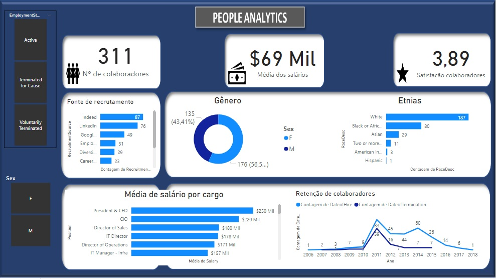

# People_Analytics

  People Analytics, ou análise de pessoas, é um método de gestão de pessoas em que utiliza-se a coleta e análise de dados dos funcionários de uma empresa para tomar decisões estratégicas e otimizar processos. É uma importante ferramenta para analisar satisfação com a empresa, definir políticas de inclusão racial, de gênero e outras, verificar o turnover e até descobrir quais variáveis que mais influenciam na promoção dos funcionários. Pode ser utilizado em empresas de todos os portes: pequenas, médias e grandes. 
  Este projeto focou na análise descritiva dos dados com o objetivo de responder algumas perguntas:
  
* Qual a média salarial dos funcionários?
* Qual é o grau de satisfação dos funcionários com a empresa?
* Quais são as plataformas mais utilizadas para prospectar novos funcionários?
* Existe em média uma diferença salarial significativa entre homens e mulheres?
* A empresa emprega, na mesma proporção, pessoas brancas e de outras etnias?
* A empresa está conseguindo reter seus funcionários?

  O banco de dados utilizado foi retirado do site: https://www.kaggle.com/rhuebner/human-resources-data-set. A análise foi feita por meio da ferramenta Power Bi.

  A empresa possui 311 funcionários entre ativos e desligados de 2006 a 2018. A média salarial foi de $ 69 mil por ano e o grau de satisfação com a empresa foi de 3,89, considerando que a nota máxima seria 5. As plataformas mais utilizadas para prospecção de funcionários foram o Ideed, Linkedin e Google Search. Contudo, se filtrarmos somente os funcionários desligados, pode-se observar que a maioria foi prospectada por meio do Google Search. 61% dos funcionários prospectados nessa plataforma foram desligados contra 24% do Indeed e 23% do Linkedin.
  
  Entre todos os funcionários, ativos e desligados, os homens ganham, em média, $ 3 mil a mais por ano do que as mulheres. Se forem considerados somente os ativos, essa diferença cai para $ 1 mil. Apesar disso, verifica-se que o quadro de funcionários é composto por  mais mulheres (176) do que homens (135).
  
  Ao longo dos anos, foram contratados 187 (60%) funcionários que se declararam brancos e 124 (40%) que se declararam de outras etnias, sendo que a maioria (80) era negro ou afro-americano. 
  
  Outra análise importe se refere à retenção de funcionários. A base de dados mostra que, no ano de 2011, a empresa contratou 83 funcionários, mas desligou 71% deles ao longo dos próximos anos. Porém, essa porcentagem diminiu a partir de 2012. Neste ano, por exemplo, foram contratados 45 funcionários e 35% acabou sendo desligado nos próximos anos. Além disso, pode-se concluir que, dos 104 funcionários desligados de 2007 a  2018, 85% ocorreram por decisão do empregado, não do empregador. 
  
  Os dados sugerem que na empresa ainda existe uma diferença salarial entre homens e mulheres. Além disso, talvez esteja faltando políticas de inclusão para prospecção de talentos de outras etnias, reforçando um compromisso social necessário nos dias de hoje e também buscando tornar o ambiente de trabalho mais plural para troca de ideias e experiências. Por fim, é importante que a empresa diagnostique o motivo da maioria dos desligamentos serem uma opção dos empregados. Será que a empresa, apesar de proporcionar a satisfação, não está sendo atrativa no plano de carreira? Está oferecendo salários menores que os da concorrência?
  
  
